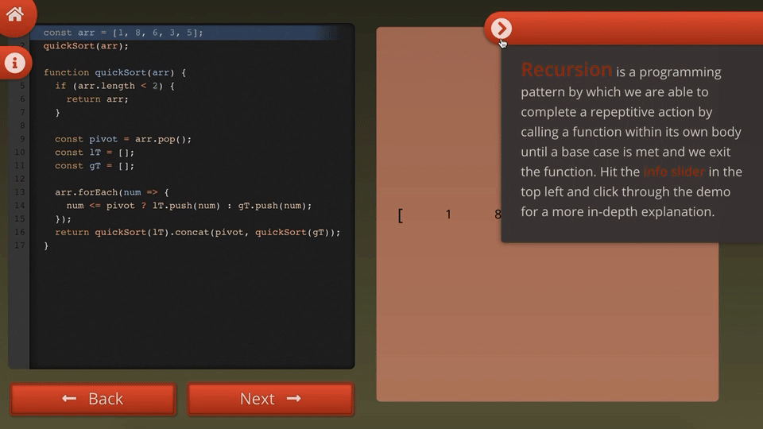
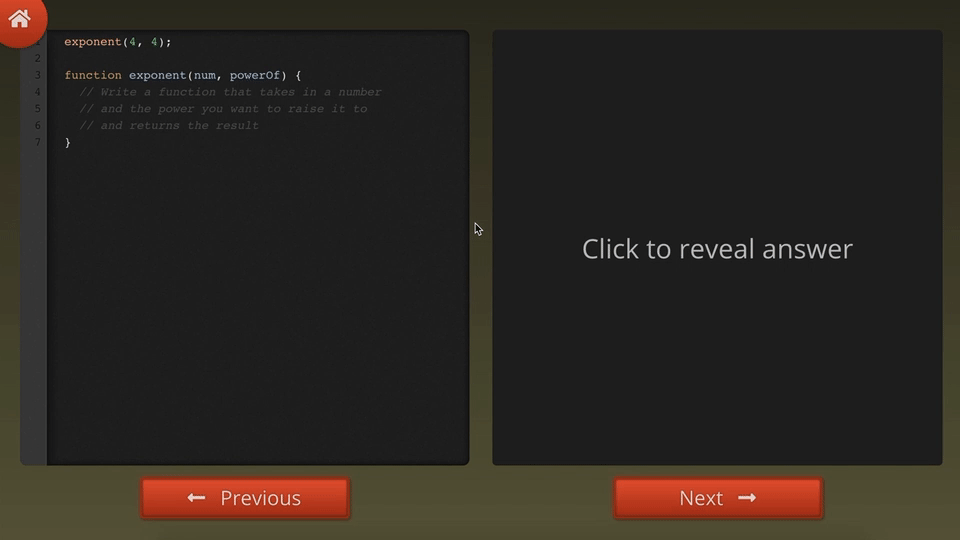

# Rabbit Hole 
## Navigating Recursion

### Abstract

The goal of this project was to build an app that could act as an educational tool for a computer science / web development topic. I decided to tackle recursion since I feel that it is a topic that benefits greatly from having some sort of visual aid in explaining what is happening. One of the pages of this app is exactly that, a demo where the user can step through the lines of code for a sorting algorithm and follow what is happening in the code with the animations on the right side. The other page is a practice space with a few problems for the user to attempt and one possible answer using recursion that can be revealed on the right. This section is easily scalable to add more practice problems as well. The app was built using React, Sass, and React-CodeMirror.

### Installation

```
git clone https://github.com/jarushford/rabbit-hole.git

cd rabbit-hole

npm install

npm start
```





### Original Wireframe


#### Author

- Jamie Rushford
  - https://github.com/jarushford
